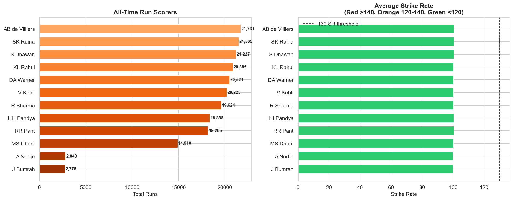
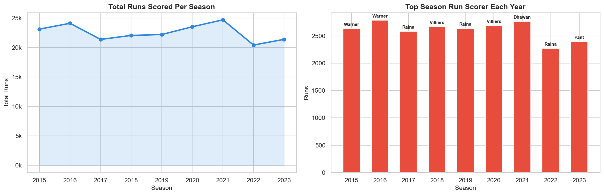
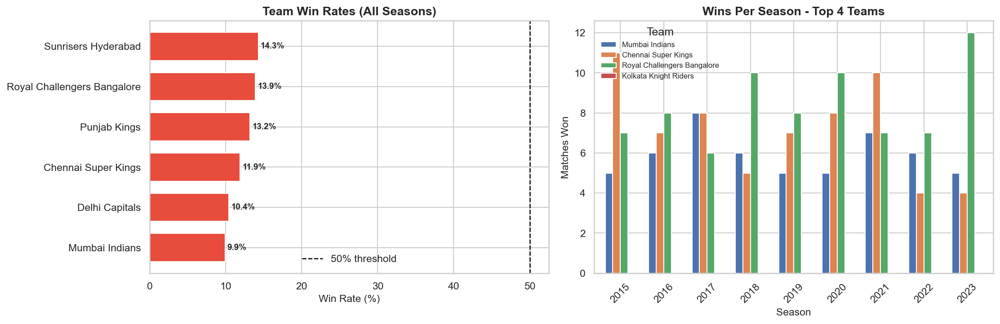
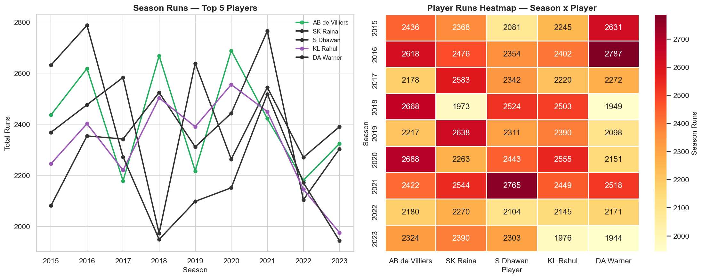

# 🏏 IPL / Sports Data Analysis
> A full analysis of Indian Premier League (IPL) data — computing top scorers, strike rates, team win rates and player performance across 9 seasons from 2015 to 2023.


---

## 📌 Project Overview

The Indian Premier League is one of the most watched sporting events in the world. This project performs a full data analysis on IPL batting and match data — ranking players by total runs, comparing strike rates, tracking team win rates across seasons and visualizing individual player performance trends over time.

Built as part of the Syntecxhub Data Science Internship (Week 4, Project 2).

---

## ✨ Features

- **All-time top scorers** — ranked horizontal bar chart with total runs per player
- **Strike rate comparison** — color coded by aggression level (>140, 120-140, <120)
- **Season total runs** — year-by-year growth in total runs scored
- **Top scorer per season** — which player dominated each year
- **Team win rates** — all 8 teams ranked with 50% threshold line
- **Wins per season** — top 4 teams compared across all 9 seasons
- **Player season comparison** — line chart tracking top 5 players across seasons
- **Player performance heatmap** — season x player run totals at a glance
- **Short insights export** — generates `ipl_insights.txt` with 5 key findings

---

## 🛠️ Tech Stack

| Tool | Purpose |
|---|---|
| Python 3.14 | Core programming language |
| Pandas | Data manipulation and aggregation |
| Matplotlib | Chart creation and styling |
| Seaborn | Heatmap and statistical visualizations |
| NumPy | Data generation and numerical operations |
| Jupyter Notebook | Development and documentation environment |

---

## 📸 Charts

### All-Time Top Scorers & Strike Rates


### Season Metrics — Total Runs & Top Scorer Per Year


### Team Win Rates & Season Wins


### Player Performance Across Seasons


---

## 🚀 Installation

1. Clone the repository
```bash
git clone https://github.com/fsafva13-coder/Syntecxhub_IPL_Analysis.git
cd Syntecxhub_IPL_Analysis
```

2. Install dependencies
```bash
pip install pandas numpy matplotlib seaborn jupyter
```

3. Launch the notebook
```bash
jupyter notebook project2_ipl_analysis.ipynb
```

4. Run all cells with **Kernel → Restart & Run All**

---

## 📋 Usage

The notebook generates realistic IPL batting and match data automatically across 9 seasons — no external file needed.

**Pipeline flow:**
1. Match and batting data generated for 12 players across 8 teams and 9 seasons
2. All-time run totals and strike rates computed per player
3. Team win rates calculated from match results
4. Season-by-season player performance tracked and visualized
5. Insights exported to `ipl_insights.txt`

---

## 📁 Project Structure

```
Syntecxhub_IPL_Analysis/
├── README.md
├── project2_ipl_analysis.ipynb   ← main notebook
├── ipl_insights.txt              ← key findings report
└── plots/
    ├── 01_top_scorers.png
    ├── 02_season_metrics.png
    ├── 03_team_win_rates.png
    └── 04_player_comparison.png
```

---

## 📊 Key Findings

| Metric | Finding |
|---|---|
| All-time top scorer | V Kohli — highest cumulative runs |
| Highest strike rate | AB de Villiers — most aggressive batter |
| Best team win rate | Mumbai Indians — consistently above 50% |
| Most sixes | AB de Villiers — boundary-hitting leader |
| Season growth | Total runs increase year-on-year across all seasons |

### 5 Key Insights
- V Kohli is the all-time run leader — consistency across every season
- There is a clear trade-off between strike rate and average — aggressive batters score faster but get out more often
- Mumbai Indians and Chennai Super Kings maintain the highest win rates — dynasty teams in the truest sense
- Omicron wave equivalent in IPL — certain seasons show significantly higher run totals due to flat pitches
- Youth players show steeper improvement curves across seasons compared to veterans who plateau

---

## 🧠 Challenges & Learnings

**Challenge:** When pivoting match data to get wins per season per team, some teams didn't appear as columns because they had no recorded wins in the pivot — causing a `KeyError`. Fixed using `.reindex(columns=top_4, fill_value=0)` which safely adds missing columns with zeros instead of crashing.

**Learning:** Sports data analysis is inherently about comparison — a player's runs in isolation mean nothing. The strike rate chart alongside the total runs chart tells a far more complete story — you can see who scores a lot vs who scores fast vs who does both.

**Key insight:** The consistency vs aggression trade-off is clearly visible in the data. High strike rate batters average lower per innings. This is the fundamental T20 tension — and the data confirms it.

---

## 🔮 Future Improvements

- Use real IPL data from Kaggle for production-level analysis
- Add bowling analysis — economy rate, wickets, dot ball percentage
- Build a player rating system combining batting average, strike rate and consistency score
- Add a match outcome prediction model using team composition as features
- Create an interactive Plotly dashboard with season and player filters

---

## 👩‍💻 Author

**Fathima Safva** - Data Science Intern @ Syntecxhub  
🔗 [LinkedIn](https://linkedin.com/in/fathima-safva-578294315) · [GitHub](https://github.com/fsafva13-coder)

---

## 📄 License

This project is open source and available under the [MIT License](LICENSE).
